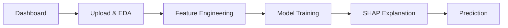
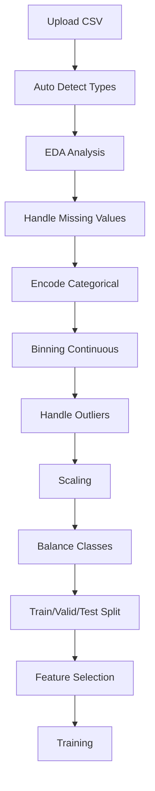

# Credit Scoring System - Tài Liệu Kỹ Thuật Chi Tiết

## Mục Lục
1. [Tổng Quan Hệ Thống](#1-tổng-quan-hệ-thống)
2. [Kiến Trúc Dự Án](#2-kiến-trúc-dự-án)
3. [Frontend (Views)](#3-frontend-views)
4. [Backend Modules](#4-backend-modules)
5. [Thuật Toán Chấm Điểm Tín Dụng](#5-thuật-toán-chấm-điểm-tín-dụng)
6. [Quy Trình Xử Lý Dữ Liệu](#6-quy-trình-xử-lý-dữ-liệu)
7. [Session State Management](#7-session-state-management)
8. [Tích Hợp AI/LLM](#8-tích-hợp-aillm)
9. [Hướng Dẫn Cài Đặt & Chạy](#9-hướng-dẫn-cài-đặt--chạy)

---

## 1. Tổng Quan Hệ Thống

### 1.1 Mục Đích
Hệ thống Credit Scoring là một nền tảng đánh giá rủi ro tín dụng hoàn chỉnh, cho phép:
- Upload và phân tích dữ liệu khách hàng (EDA)
- Xử lý dữ liệu (missing values, encoding, binning, balancing)
- Huấn luyện nhiều loại model ML (Logistic Regression, Random Forest, XGBoost, LightGBM, CatBoost)
- Giải thích model bằng SHAP values + AI interpretation
- Dự đoán và tính điểm tín dụng theo chuẩn ngành

### 1.2 Technology Stack
| Component | Technology |
|-----------|------------|
| **Frontend** | Streamlit |
| **Backend** | Python, scikit-learn, XGBoost, LightGBM, CatBoost |
| **Explainability** | SHAP |
| **AI Integration** | Google Gemini API |
| **Data Processing** | Pandas, NumPy, imbalanced-learn |
| **Visualization** | Plotly |

---

## 2. Kiến Trúc Dự Án

```
credit-scoring/
├── app.py                    # Entry point - Main router
├── views/                    # UI Pages (6 views)
│   ├── home.py               # Dashboard + Workflow progress
│   ├── upload_eda.py         # Data upload + EDA
│   ├── feature_engineering.py # Feature processing (4131 lines)
│   ├── model_training.py     # Training + Tuning
│   ├── shap_explanation.py   # SHAP analysis + AI interpretation
│   └── prediction.py         # Single prediction + Credit score
├── backend/                  # Business logic
│   ├── models/               # ML models
│   │   ├── trainer.py        # Training, CV, Hyperparameter tuning
│   │   ├── predictor.py      # Prediction + Credit score calculation
│   │   └── feature_importance.py
│   ├── data_processing/      # Data transformations
│   │   ├── encoder.py        # Categorical encoding (One-Hot, Label, Target, Frequency)
│   │   ├── balancer.py       # SMOTE, ADASYN, undersampling
│   │   ├── outlier_handler.py
│   │   └── preprocessing_pipeline.py
│   ├── explainability/       # SHAP
│   │   └── shap_explainer.py
│   └── llm_integration/      # AI Analysis
│       ├── config.py         # API keys config
│       ├── eda_analyzer.py   # AI analysis for EDA
│       └── shap_analyzer.py  # AI interpretation for SHAP
├── utils/
│   ├── session_state.py      # Streamlit session management
│   └── ui_components.py      # Reusable UI components
└── requirements.txt
```

---

## 3. Frontend (Views)

### 3.1 Navigation Flow


### 3.2 Chi Tiết Từng View

#### 3.2.1 Dashboard (`home.py`)
- Hiển thị workflow progress bar (8 bước)
- Thống kê session hiện tại
- Quick stats về data và model

#### 3.2.2 Upload & EDA (`upload_eda.py`)
**Chức năng:**
- Upload CSV files
- Tự động detect data types
- EDA visualizations (histograms, box plots, correlation matrix)
- AI-powered EDA analysis (sử dụng Gemini)

#### 3.2.3 Feature Engineering (`feature_engineering.py`)
**File lớn nhất (4131 lines), bao gồm:**

| Tab | Chức năng |
|-----|-----------|
| **Tiền Xử Lý** | Chia Train/Valid/Test, chọn target |
| **Missing Values** | Mean/Median/Mode/Forward Fill/Backward Fill |
| **Encoding** | One-Hot, Label, Target, Ordinal, Frequency |
| **Binning** | Equal Width, Equal Frequency, **Optimal Binning (WoE/IV)**, Custom |
| **Outliers** | IQR, Z-score, Winsorization |
| **Scaling** | StandardScaler, MinMaxScaler, RobustScaler |
| **Balancing** | SMOTE, ADASYN, Random Under/Over sampling |
| **Feature Selection** | Manual selection, correlation-based, importance-based |

##### Optimal Binning Algorithm (WoE/IV)
```python
# 1. Sử dụng Decision Tree để tìm điểm cắt tối ưu
tree = DecisionTreeClassifier(
    max_leaf_nodes=num_bins,
    min_samples_leaf=5% data  # Mỗi bin ≥ 5%
)
tree.fit(X_column, y_target)

# 2. Lấy thresholds từ cây
thresholds = tree.tree_.threshold
bins = [-inf] + thresholds + [inf]

# 3. Tính WoE và IV
WoE = ln(% Good / % Bad)
IV = Σ (% Good - % Bad) × WoE
```

#### 3.2.4 Model Training (`model_training.py`)
**Supported Models:**
- Logistic Regression
- Random Forest
- XGBoost
- LightGBM
- CatBoost
- Gradient Boosting

**Training Options:**
- Standard Training
- Cross-Validation
- Hyperparameter Tuning (Grid Search, Random Search, Optuna)

#### 3.2.5 SHAP Explanation (`shap_explanation.py`)
- Global Feature Importance (mean |SHAP|)
- Summary Plot
- Force Plot cho từng sample
- AI Interpretation (Gemini chat)

#### 3.2.6 Prediction (`prediction.py`)
- Single sample prediction
- Credit Score calculation
- Risk level assessment
- Recommendations

---

## 4. Backend Modules

### 4.1 Model Trainer (`backend/models/trainer.py`)

```python
def train_model(X_train, y_train, X_test, y_test, model_type, params=None):
    """
    Train model và trả về (model, metrics)
    
    Returns:
        model: Trained sklearn/xgb/lgb/cb model
        metrics: {accuracy, precision, recall, f1, auc}
    """

def cross_validate_model(X, y, model_type, params=None, cv_folds=5):
    """K-fold Cross-validation với stratified sampling"""

def hyperparameter_tuning(X, y, model_type, method, cv_folds=5, n_trials=50):
    """Grid Search, Random Search, Optuna (Bayesian)"""
```

### 4.2 Predictor (`backend/models/predictor.py`)

```python
def predict_single(model, input_data, feature_names, feature_stats=None):
    """
    Dự đoán cho 1 sample, trả về:
    - prediction: 0/1
    - probability: PD (probability of default)
    - credit_score: 300-850
    - risk_level: Very Low/Low/Medium/High/Very High
    - approval_status: approved/conditional/rejected
    - Recommendations
    """
```

### 4.3 Encoder (`backend/data_processing/encoder.py`)

```python
class CategoricalEncoder:
    def one_hot_encoding(data, columns, drop_first=False)
    def label_encoding(data, columns)
    def target_encoding(data, columns, target_column, smoothing=1.0)
    def ordinal_encoding(data, columns, ordinal_mappings=None)
    def frequency_encoding(data, columns)
    def recommend_encoding_method(data, column, target_column=None)
```

### 4.4 Balancer (`backend/data_processing/balancer.py`)

```python
def balance_data(data, target_column, method="SMOTE", **kwargs):
    """
    Methods: SMOTE, ADASYN, BorderlineSMOTE, 
             RandomOverSampler, RandomUnderSampler, 
             TomekLinks, SMOTEENN
    """
```

### 4.5 SHAP Explainer (`backend/explainability/shap_explainer.py`)

```python
class SHAPExplainer:
    def __init__(model, X_background, model_type):
        """
        Auto-select explainer:
        - TreeExplainer: RF, XGB, LGB, CB, GB
        - LinearExplainer: Logistic Regression
        - KernelExplainer: Fallback
        """
    
    def compute_shap_values(X)  # → np.ndarray
    def get_feature_importance()  # → DataFrame
    def get_local_explanation(sample_idx, X)  # → Dict
```

---

## 5. Thuật Toán Chấm Điểm Tín Dụng

### 5.1 Credit Score Formula

> **Industry Standard: Log-Odds Scaling**

```python
# Constants
PDO = 30            # Points to Double Odds
base_score = 600    # Score at base odds
base_odds = 19      # Odds 19:1 = PD 5%

# Calculation
factor = PDO / ln(2)  # ≈ 43.29
odds = (1 - PD) / PD
credit_score = base_score + factor × ln(odds / base_odds)

# Example:
# PD = 5%  →  odds = 19  →  Score = 600
# PD = 10% →  odds = 9   →  Score ≈ 567
# PD = 2%  →  odds = 49  →  Score ≈ 640
```

### 5.2 Risk Level Thresholds (5-tier)

| PD Range | Risk Level | Màu |
|----------|------------|-----|
| < 2% | Rất thấp | 🟢 #10b981 |
| 2-5% | Thấp | 🟢 #22c55e |
| 5-10% | Trung bình | 🟠 #f59e0b |
| 10-20% | Cao | 🔴 #ef4444 |
| > 20% | Rất cao | 🔴 #dc2626 |

### 5.3 Score Interpretation (5-tier)

| Score Range | Interpretation |
|-------------|----------------|
| 750-850 | Xuất sắc |
| 650-749 | Tốt |
| 550-649 | Trung bình |
| 450-549 | Kém |
| 300-449 | Rất kém |

### 5.4 Approval Decision Logic

```python
if PD < 5% AND score >= 650:
    → "Phê duyệt"
elif PD < 10% OR (550 <= score < 650):
    → "Có thể xem xét với điều kiện"
else:
    → "Từ chối - Rủi ro cao"
```

---

## 6. Quy Trình Xử Lý Dữ Liệu



### 6.1 Data Flow trong Session State

```
st.session_state.data                  # Raw data
st.session_state.processed_data        # After preprocessing
st.session_state.train_data/valid_data/test_data  # Split data
st.session_state.selected_features     # Feature list for model
st.session_state.model                 # Trained model object
st.session_state.model_metrics         # {accuracy, precision, recall, f1, auc}
```

---

## 7. Session State Management

### 7.1 Key Session Variables

| Category | Variables |
|----------|-----------|
| **Data** | `data`, `processed_data`, `train_data`, `valid_data`, `test_data` |
| **Target** | `target_column` |
| **Model** | `model`, `model_type`, `selected_model_name`, `model_metrics` |
| **SHAP** | `shap_explainer_obj`, `shap_values_computed`, `shap_feature_importance` |
| **Configs** | `missing_config`, `encoding_config`, `binning_config`, `scaling_config` |
| **AI** | `ai_analysis`, `shap_chat_history` |

### 7.2 State Lifecycle

```python
# Initialize
init_session_state()  # Called on every page load

# Clear on new data upload
clear_data_related_state()  # Resets all model/SHAP/configs

# Check status
get_session_info()  # Returns {has_data, has_model, num_features, ...}
```

---

## 8. Tích Hợp AI/LLM

### 8.1 Providers Supported
- **Google Gemini** (default): `gemini-2.5-flash`
- OpenAI GPT (optional)
- Anthropic Claude (optional)

### 8.2 AI Features

| Feature | Module | Description |
|---------|--------|-------------|
| EDA Analysis | `eda_analyzer.py` | Phân tích tự động data quality, recommendations |
| SHAP Interpretation | `shap_analyzer.py` | Giải thích feature importance, local explanations |
| Chat | `shap_analyzer.py` | Hỏi đáp về model |

### 8.3 Configuration

```bash
# .env file
GOOGLE_API_KEY=your_gemini_api_key
```

```python
# backend/llm_integration/config.py
class LLMConfig:
    GOOGLE_API_KEY = os.getenv('GOOGLE_API_KEY')
    GOOGLE_MODEL = 'gemini-2.5-flash'
```

---

## 9. Hướng Dẫn Cài Đặt & Chạy

### 9.1 Requirements
```bash
pip install -r requirements.txt
```

**Key dependencies:**
- streamlit
- pandas, numpy
- scikit-learn
- xgboost, lightgbm, catboost
- shap
- imbalanced-learn
- plotly
- google-generativeai (optional)

### 9.2 Run Application
```bash
# Windows
RUN_APP.bat

# Linux/Mac
./RUN_APP.sh

# Or directly
streamlit run app.py
```

### 9.3 Sample Data
Located in `sample_data/` folder with example credit datasets.

---

## Appendix: API Reference

### Trainer API
```python
from backend.models.trainer import train_model, cross_validate_model, hyperparameter_tuning

model, metrics = train_model(X_train, y_train, X_test, y_test, "XGBoost", params)
cv_results = cross_validate_model(X, y, "Random Forest", params, cv_folds=5)
tuning_results = hyperparameter_tuning(X, y, "LightGBM", method="Optuna", n_trials=100)
```

### Predictor API
```python
from backend.models.predictor import predict_single, predict_batch

result = predict_single(model, input_dict, feature_names)
# result = {
#     'prediction': 1,
#     'probability': 0.08,
#     'credit_score': 625,
#     'risk_level': 'Medium',
#     'approval_status': 'conditional',
#     ...
# }
```

### SHAP API
```python
from backend.explainability.shap_explainer import initialize_shap_explainer

explainer, shap_values, X_explained = initialize_shap_explainer(model, X_train, "XGBoost")
importance_df = explainer.get_feature_importance()
local_exp = explainer.get_local_explanation(sample_idx=0, X=X_explained)
```

---

*Document Version: 1.0 | Last Updated: 2025-12-25*
